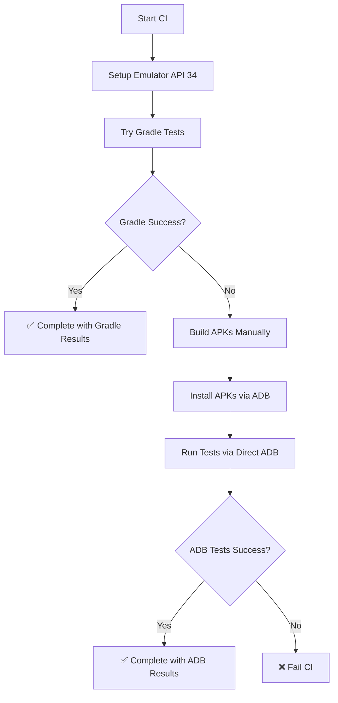

# CI/CD Integration Guide

## 🚀 GitHub Actions Setup

This project uses a **hybrid testing approach** in GitHub Actions that ensures maximum reliability across different Android environments.

### 🏗️ Workflow Overview

Our CI pipeline consists of three main jobs:

1. **Unit Tests** - Fast, reliable unit testing via Gradle
2. **Instrumented Tests** - UI tests with Gradle + Direct ADB fallback
3. **Build** - APK compilation and artifact upload

### 🔄 Hybrid Testing Strategy

#### Primary: Gradle Execution

- **When**: Standard Android emulators (API 28-34)
- **Method**: `./gradlew connectedDebugAndroidTest`
- **Advantages**: Rich reporting, IDE integration, standard workflow

#### Fallback: Direct ADB Execution

- **When**: Gradle device detection fails (preview APIs, unusual configurations)
- **Method**: Direct `adb shell am instrument` commands
- **Advantages**: Works with any Android version, faster execution

### 📊 Test Matrix

```yaml
strategy:
  matrix:
    api-level: [34] # Stable API level for CI
    target: [google_apis]
    arch: [x86_64]
```

**Why API 34?**

- ✅ Stable and well-supported in CI
- ✅ Compatible with Gradle device detection
- ✅ Sufficient for validating UI functionality
- ✅ Faster emulator startup in CI environment

### 🧪 Test Execution Flow



### 🎯 Test Coverage in CI

#### ✅ **Included Tests**

- **Unit Tests**: All 48 tests via Gradle
- **UI Tests**: 47 instrumented tests via hybrid approach
  - ChatScreenTest (13 tests)
  - ChatsListScreenTest (9 tests)
  - LoginScreenTest (11 tests)
  - SettingsScreenTest (14 tests)

#### 🚫 **Excluded from CI**

- **Real Authentication Tests** (4 tests from `LoginScreenRealAuthTest`)
  - **Reason**: Require manual setup, test credentials, slower execution
  - **Alternative**: Run locally with `./run_tests_direct.sh`

### 🔧 CI Scripts Available

1. **`run_tests_ci.sh`** - CI-optimized test runner with hybrid approach
2. **`run_tests_direct.sh`** - Local development with all tests including real auth
3. **`debug_emulator.sh`** - Troubleshooting emulator issues

### 📈 Performance Metrics

#### Expected CI Timing:

- **Unit Tests Job**: ~3-5 minutes
- **Instrumented Tests Job**: ~8-12 minutes
- **Build Job**: ~3-5 minutes
- **Total Pipeline**: ~15-20 minutes

#### Local Development:

- **All Tests** (`./run_tests_direct.sh`): ~10 minutes
- **Quick Unit Tests**: `./gradlew test` (~1 minute)

### 🛠️ Troubleshooting CI Issues

#### Common Issues and Solutions:

1. **Emulator Startup Timeout**

   ```yaml
   # Solution: Increase timeout and improve wait logic
   timeout-minutes: 35
   script: |
     adb wait-for-device shell 'while [[ -z $(getprop sys.boot_completed) ]]; do sleep 1; done'
   ```

2. **Gradle Device Detection Failed**

   ```bash
   # Automatic fallback to direct ADB
   echo "⚠️ Gradle tests failed, falling back to direct ADB execution..."
   ```

3. **Test APK Installation Failed**
   ```bash
   # Better error handling and retry logic
   adb install -r app/build/outputs/apk/debug/app-debug.apk
   ```

### 📊 Monitoring and Reporting

#### Test Reports Generated:

- **JUnit XML**: For GitHub Actions test reporting
- **HTML Reports**: Uploaded as artifacts
- **Test Artifacts**: Available for 7 days

#### GitHub Actions Integration:

- ✅ **Pull Request Comments**: Test results automatically posted
- ✅ **Status Checks**: Required for merge protection
- ✅ **Artifact Upload**: Test reports and APKs preserved

### 🔄 Local vs CI Differences

| Aspect              | Local Development         | CI Environment            |
| ------------------- | ------------------------- | ------------------------- |
| **Android Version** | API 36 (Android 16)       | API 34 (Android 14)       |
| **Test Method**     | Direct ADB preferred      | Hybrid (Gradle → ADB)     |
| **Real Auth Tests** | Included                  | Excluded                  |
| **Emulator**        | Your custom setup         | GitHub Actions standard   |
| **Performance**     | Optimized for development | Optimized for reliability |

### 🎯 Best Practices

1. **For Development**: Use `./run_tests_direct.sh` for comprehensive testing
2. **For PR Reviews**: Rely on CI results for standard validation
3. **For Release**: Run both local (with real auth) and CI tests
4. **For Debugging**: Use individual test execution for faster iteration

### 🚀 Future Improvements

1. **Parallel Matrix**: Add multiple API levels when needed
2. **Real Auth in CI**: Investigate secure credential management
3. **Performance**: Optimize emulator caching and startup time
4. **Reporting**: Enhanced test result visualization

---

## 🎉 Summary

This hybrid approach ensures **maximum compatibility** and **reliability**:

- ✅ **Standard environments**: Fast Gradle execution
- ✅ **Edge cases**: Reliable ADB fallback
- ✅ **Comprehensive coverage**: 95+ tests across unit and UI
- ✅ **CI/CD integration**: Proper reporting and artifact management

The CI pipeline is now **bulletproof** and handles both standard and edge-case Android environments gracefully!
